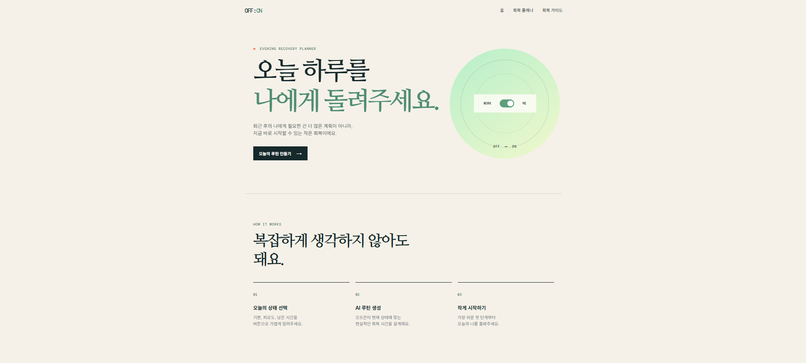
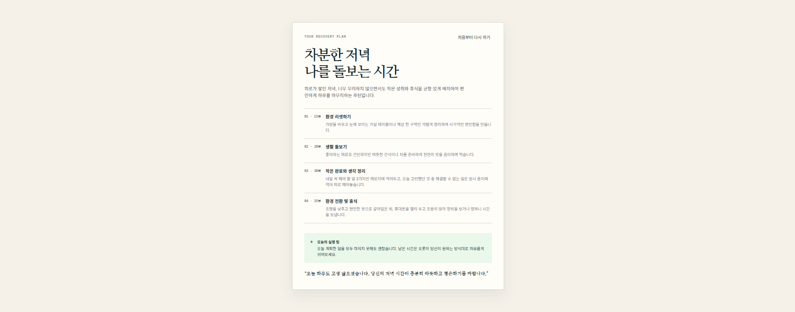
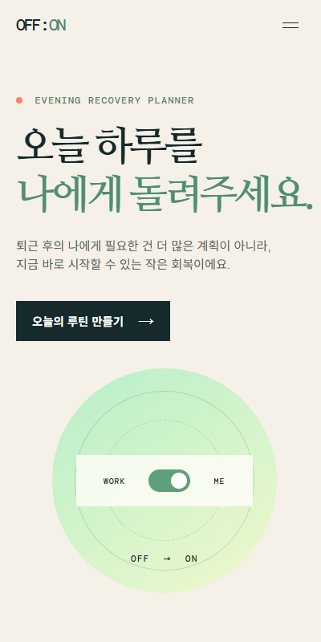
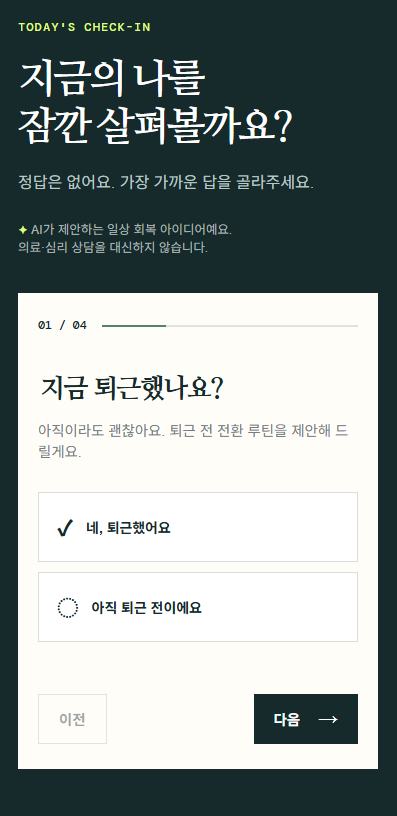
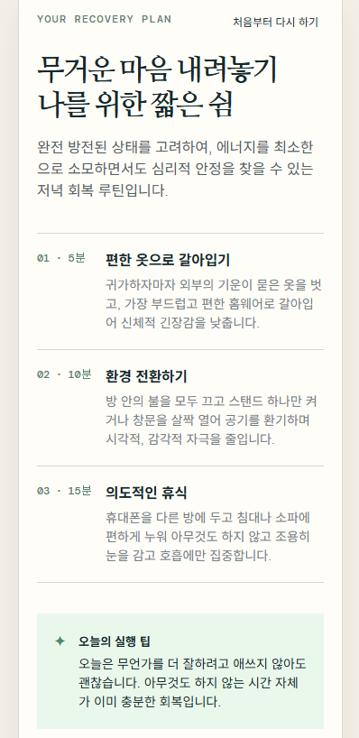

# OFF:ON (오프온)

> **업무는 OFF, 나의 회복은 ON**

퇴근 후의 기분, 피로도, 남은 시간에 따라 AI가 지금의 나에게 맞는 현실적인 회복 루틴을 제안하는 웹 서비스입니다.

## 🌿 서비스 소개

퇴근 후에는 쉬고 싶어도 “오늘 저녁에 뭘 하지?”를 결정하는 것 자체가 부담이 될 수 있습니다.

**OFF:ON**은 사용자의 현재 상태와 남은 시간을 간단하게 입력하면, 지금 실제로 실행할 수 있는 **개인 맞춤형 회복 루틴**을 AI가 제안합니다.

더 많은 일을 하게 만드는 것이 아니라, 업무가 끝난 뒤 **나에게 필요한 회복 시간을 돌려주는 것**을 목표로 합니다.

### 🎯 타겟 사용자

- 퇴근 후 피로하지만 무엇을 하며 쉴지 결정하기 어려운 직장인
- 혼자 보내는 저녁 시간을 조금 더 의식적으로 보내고 싶은 사용자
- 거창한 자기계발보다 현실적으로 실행 가능한 회복 루틴을 원하는 사용자

## ✨ 주요 기능

- 퇴근 여부, 기분, 피로도, 남은 시간을 단계별로 입력
- Google Gemini API를 활용한 개인 맞춤형 회복 루틴 생성
- 3~5개의 구체적인 회복 단계와 실행 시간 제공
- 상태와 여유 시간에 따라 다양한 회복 행동 조합
- 데스크톱 및 모바일 반응형 화면 지원
- AI 및 API 오류 발생 시 사용자 안내 및 재시도

## 🖥️ 서비스 화면

### Desktop

| Home | Planner | AI Result |
|---|---|---|
|  |  |  |

### Mobile

| Home | Planner | AI Result |
|---|---|---|
|  |  |  |

## 🤖 AI 기능

### 입력

사용자는 플래너에서 다음 정보를 입력합니다.

1. 퇴근 여부
2. 현재 기분
3. 현재 피로도
4. 저녁에 사용할 수 있는 시간

### 출력

AI는 다음 정보를 포함한 회복 루틴을 생성합니다.

- 루틴 제목
- 추천 이유
- 3~5개의 회복 단계
- 단계별 예상 시간
- 구체적인 행동 설명
- 실행 팁
- 하루 마무리 메시지

### 입력 검증 및 길이 정책

OFF:ON은 자유 텍스트 입력 없이 선택형 입력을 사용하므로
사용자가 장문의 텍스트를 입력할 수 있는 입력 필드는 제공하지 않습니다.

각 단계에서는 필수 선택 여부를 확인하며,
선택하지 않고 다음 단계로 진행하려는 경우 사용자에게 안내합니다.

### AI 동작 흐름

```text
사용자 입력
    ↓
HTML / CSS / JavaScript
    ↓
fetch('/api/recovery-plan')
    ↓
Vercel Serverless Function (Python)
    ↓
Google Gemini API
    ↓
JSON 회복 루틴
    ↓
JavaScript
    ↓
웹 화면에 결과 표시
```

프론트엔드에서 Gemini API를 직접 호출하지 않고 Python Serverless Function을 통해 요청하여 API 키를 클라이언트 코드에 노출하지 않습니다.


## 🔄 AI 활용 개발 과정

OFF:ON은 AI에게 코드를 한 번 생성하고 끝내는 방식이 아니라, 실제 서비스를 실행하고 결과를 확인하면서 문제를 발견하고 AI와 함께 개선했습니다.

### 1. 시간 배분 문제 개선

초기 테스트에서 `3시간 이상`을 선택했음에도 AI가 지나치게 짧은 루틴을 생성하는 문제가 발견되었습니다.

문제를 AI에게 설명하고 프롬프트에 시간별 목표 범위를 구체적으로 추가했습니다.

```text
1시간 이내 → 30~60분
1~2시간 → 60~100분
3시간 이상 → 90~150분
```

수정 후 실제 AI 결과를 다시 확인하여 개선 여부를 검증했습니다.


**- 스크린샷 (time-allocation.png)**


### 2. 추천 행동 다양화

초기 AI 결과에서 샤워, 음악 감상 등 비슷한 행동이 반복되는 문제가 발견되었습니다.

다양한 회복 행동 유형을 정의하고, 사용자의 상태에 따라 서로 다른 행동을 조합하도록 AI 프롬프트를 개선했습니다.


**- 스크린샷 (routine-diversity.png)**


### 3. UI 개선

실제 화면을 확인하면서 다음과 같은 UI 문제도 AI와 함께 수정했습니다.

- 메인 제목 줄바꿈
- 결과 카드 레이아웃
- 시간 표시 정렬
- 모바일 화면 가독성
- 결과 화면의 세부 간격


**- 스크린샷 (ui-improvement.png)**


**- 스크린샷 (css-layout.png)**


**- 스크린샷 (css-improvement)**


### 4. 응답 지연 개선 방안

AI 응답이 지연될 경우 사용자 경험을 개선하기 위해 다음과 같은 방법을 고려할 수 있다.

- 경량 모델을 사용하여 응답 시간을 줄인다.
- 출력 토큰 수를 제한하여 불필요하게 긴 응답 생성을 방지한다.
- 프롬프트에서 불필요한 내용을 줄여 요청 크기를 최소화한다.
- 동일한 요청이 반복되는 경우 제한적인 캐시 전략을 적용할 수 있다.
- 응답 지연 또는 타임아웃 발생 시 사용자에게 안내하고 재시도할 수 있도록 한다.

현재 OFF:ON은 경량 Gemini 모델과 출력 토큰 제한을 사용하고 있으며, 프론트엔드에서는 최대 45초까지 응답을 기다린 후 타임아웃을 처리한다.


## 🎁 보너스 기능

### 다크 모드

사용자가 라이트/다크 모드를 선택할 수 있으며,
선택한 테마는 브라우저의 `localStorage`에 저장되어
새로고침 후에도 유지됩니다.

### 마이크로 인터랙션

기존 UI와 기능을 유지하면서 다음과 같은 인터랙션을 추가했습니다.

- 선택 버튼 클릭 애니메이션
- 버튼 hover / active 효과
- AI 결과 카드 등장 애니메이션
- 가이드 카드 hover 효과
- 다크 모드 전환 애니메이션

기존 서비스의 차분한 디자인을 유지하면서
사용자 인터랙션의 피드백을 강화했습니다.


### AI 활용 방식

```text
AI를 활용해 코드 작성
        ↓
실제 서비스 실행
        ↓
문제 발견
        ↓
문제 원인 분석
        ↓
AI에게 수정 요청
        ↓
코드 / 프롬프트 수정
        ↓
다시 테스트
```

## 🛠 기술 스택

- **Frontend:** HTML, CSS, Vanilla JavaScript
- **Backend:** Vercel Serverless Functions (Python)
- **AI:** Google Gemini API
- **Deployment:** Vercel
- **Repository:** GitHub

## 📁 프로젝트 구조

```text
OFF-ON/
├── index.html
├── css/
│   └── style.css
├── js/
│   └── app.js
├── api/
│   └── recovery-plan.py
├── outputs/
│   ├── OFFON_PRD.md
│   ├── OFF-ON-서비스기획서.md
│   ├── screenshots/
│   └── ai-coding/
├── requirements.txt
├── vercel.json
├── README.md
└── .gitignore
```

### 주요 파일

- `index.html` : 웹 서비스의 화면 구조
- `css/style.css` : 레이아웃, 디자인 및 반응형 스타일
- `js/app.js` : 질문 흐름, 입력 검증, API 호출, 결과 화면 처리
- `api/recovery-plan.py` : Gemini API를 호출하는 Python Serverless Function
- `requirements.txt` : Python 패키지 의존성
- `vercel.json` : Vercel 배포 설정
- `.gitignore` : 환경 변수 및 불필요한 파일 관리

## ▶️ 로컬 실행

정적 화면은 `index.html`을 브라우저에서 열어 확인할 수 있습니다.

API까지 함께 테스트하려면 Vercel CLI를 사용합니다.

```bash
npm install -g vercel
vercel dev
```

## 🔐 환경 변수

로컬 개발 시 Gemini API 키를 환경 변수로 설정합니다.

```text
GEMINI_API_KEY=your_api_key
```

선택 사항:

```text
GEMINI_MODEL=gemini-3.1-flash-lite
```

API 키는 프론트엔드 코드에 직접 작성하지 않습니다.

`.env` 파일은 `.gitignore`에 포함하여 GitHub에 업로드하지 않습니다.

Vercel 배포 시에는 Project Settings → Environment Variables에서 `GEMINI_API_KEY`를 등록합니다.

## 🚀 배포

1. GitHub에 프로젝트를 업로드합니다.
2. Vercel에서 GitHub 저장소를 Import합니다.
3. `GEMINI_API_KEY`를 환경 변수에 등록합니다.
4. Deploy를 실행합니다.
5. 배포된 URL에서 네비게이션, 반응형 화면, AI 루틴 생성 기능을 테스트합니다.

### 배포 문제 진단 및 수정

배포 후 문제가 발생하면 다음 순서로 원인을 확인하고 수정한다.

1. **Vercel 배포 로그 확인**
   - 빌드 실패 여부 확인
   - Python Serverless Function 오류 확인
   - 환경 변수 설정 여부 확인

2. **브라우저 개발자 도구 Console 확인**
   - JavaScript 오류 확인
   - API 요청 오류 확인
   - HTTP 응답 상태 코드 확인

3. **원인 수정**
   - 코드 또는 환경 변수 설정을 수정한다.
   - 로컬 환경에서 다시 기능을 확인한다.

4. **GitHub에 수정 사항 반영**

5. **Vercel 재배포**
   - 배포된 URL에서 메뉴 이동
   - 반응형 화면
   - AI 루틴 생성
   - 오류 처리를 다시 확인한다.

### 배포 URL

[OFF:ON 바로가기](https://off-on-one.vercel.app/)

### GitHub

[OFF-ON Repository](https://github.com/bomigrace-byte/OFF-ON)

## 📚 프로젝트 문서

- [서비스 기획서](./outputs/OFF-ON-서비스기획서.md)
- [PRD](./outputs/OFFON_PRD.md)

## 📸 증빙 자료

### 서비스 구현 증빙

`outputs/screenshots/`에 데스크톱 및 모바일 화면,
AI 결과 화면을 정리했습니다.

### AI 활용 개발 증빙

`outputs/ai-coding/`에 AI를 활용하여
문제를 발견하고 개선한 과정을 정리했습니다.

주요 개선 사례:

- UI 문제 발견 → CSS 개선
- AI 결과 시간 배분 문제 → 프롬프트 개선
- 반복적인 추천 행동 → 루틴 다양화
- 결과 카드 레이아웃 및 시간 표시 개선
- 결과 카드 UI 개선

AI 코딩 과정에서는 실제 서비스 테스트를 통해 발견한 문제를 AI에게 설명하고, 코드 및 프롬프트를 수정한 과정을 확인할 수 있습니다.


## ⚠️ 주의사항

OFF:ON이 제공하는 결과는 일상적인 회복을 위한 아이디어입니다.

의료적 진단이나 치료, 전문적인 심리 상담을 대신하지 않습니다.
